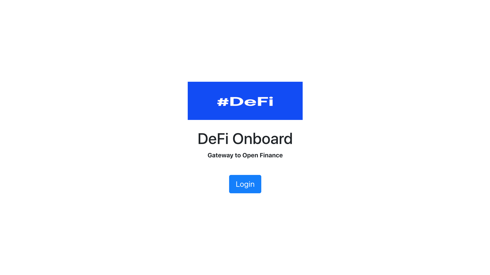
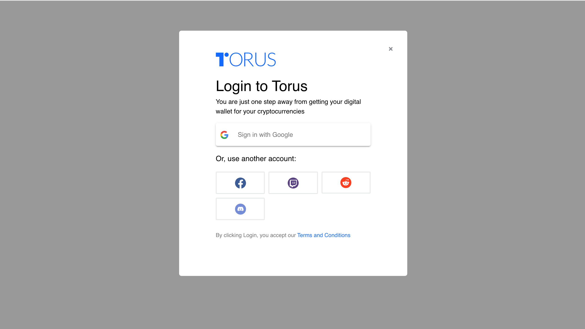
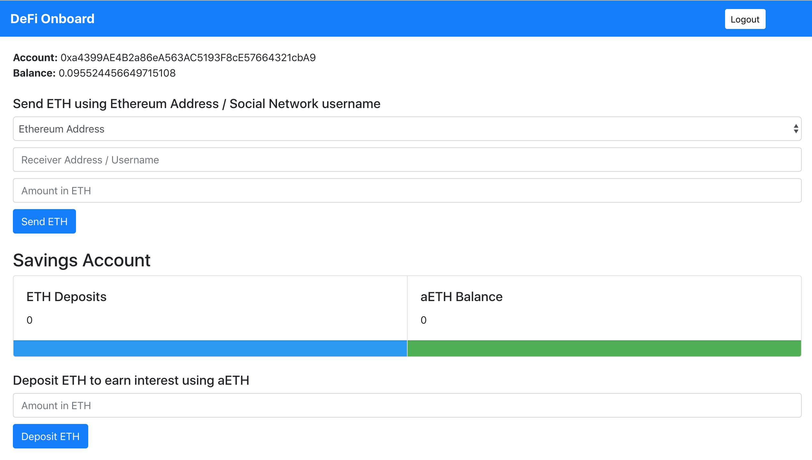
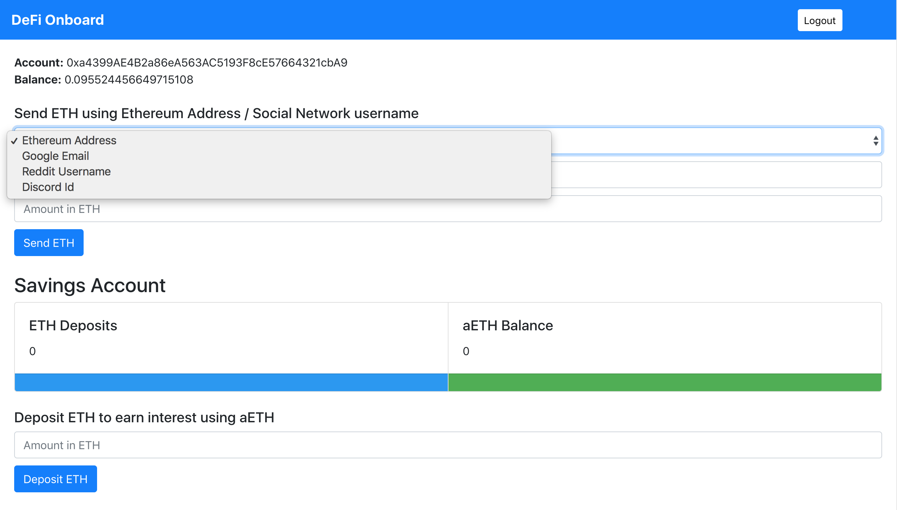
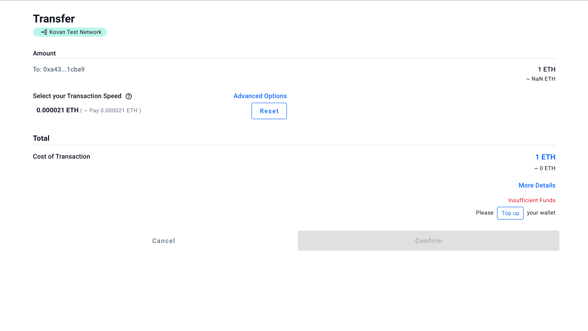
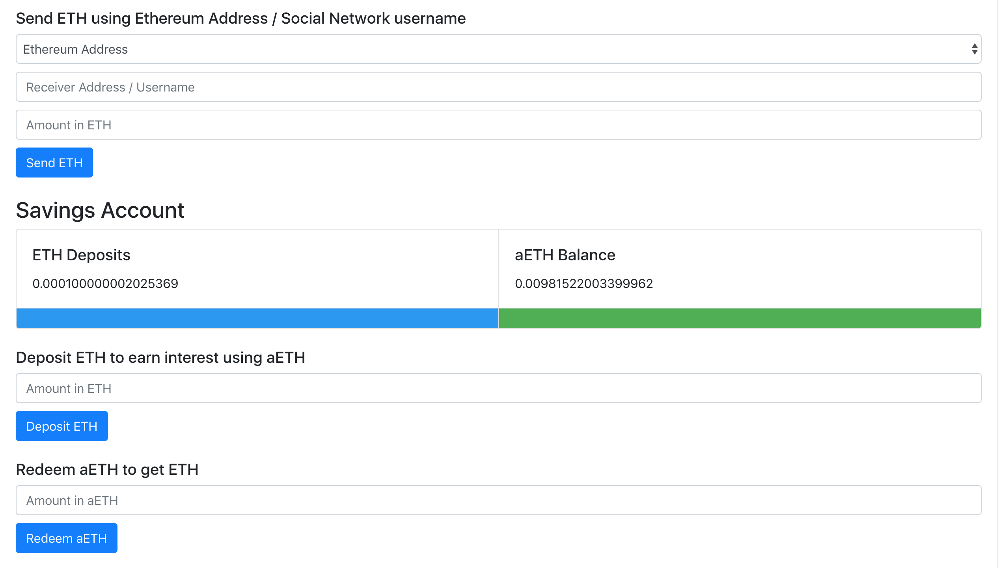

# DeFi Onboard
Simplifying the DeFi onboarding user experience for the next billion users

## Project Summary
DeFi Onboard simplifies the DeFi onboarding user experience for the next billion users. It uses common metaphors to 
give the user instantaneous knowledge about how to interact with the user interface.
The onboarding flow can be integrated by any dapp easily. Hence developers can add DeFi capabilities to their dapp without any complexities.

Users can login with their Google, Facebook, Twitch, Reddit or Discord account to get their
own DeFi web wallet. User's can send or receive ETH using Ethereum Address, Google Email, 
Reddit Username or Discord Id. User's can top up their wallet using fiat onramp. User's can
deposit ETH to earn interest using aETH tokens. User's can redeem aETH tokens to get ETH back whenever they want.

## Link to Ancillary Material
Pitch Deck: https://docs.google.com/presentation/d/1KJ3rIxuBVcomG5HVa7gzIu5e90JKH7GLwZn_vTqajqI/

Video Demo: https://youtu.be/EK3BxwhljfY

## Project Launch Page
https://defi-onboard.netlify.com/ (Kovan testnet)

## Screenshots

**Login Page**

**Login Page (Social Login Options - Google, Facebook, Twitch, Reddit, Discord)**

**Home Page (Send, Receive and Deposit ETH)**

**Send ETH using Ethereum Address, Google Email, Reddit Username and Discord Id**

**Transaction Confirm Page (Sufficient balance)**

**Transaction Confirm Page (Insufficient balance)**

**Top up wallet using fiat onramp**

**Deposit eth to earn interest**
